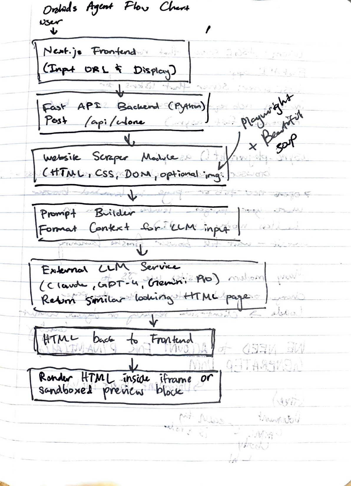

#   

# Orchids SWE Intern Challenge Template

This project consists of a backend built with FastAPI and a frontend built with Next.js and TypeScript. Project enables users to input a public website URL and receive a clean HTML clone generated by an AI backend. The backend scrapes the website content using Playwright, processes it via OpenAI's GPT API, and returns a standalone HTML page rendered in the frontend.


## Prerequisites

- Python 3.9+  
- Node.js 16+  
- OpenAI API Key (set in `.env` file for backend)  
- `uv` CLI installed globally (for backend package management)

## Environment Variables

Create a `.env` file in the backend directory with the following content: 
OPENAI_API_KEY=your_openai_api_key_here

### Installation

To install the backend dependencies, run the following command in the backend project directory:

```bash
uv sync
```
Or, if you are using pip:

```bash
pip install -r requirements.txt
```

## Playwright Installation
Make sure to install this. This is to install the Browser Binaries.

```bash
playwright install
```

### NPM Installation 

To install the frontend dependencies, navigate to the frontend project directory and run:

```bash
npm install
```

### Running the Frontend

To start the frontend development server, run:

```bash
npm run dev
```

### Running the Backend

To run the backend development server, use the following command:

```bash
uv run fastapi dev 
```

OR If you are using pip and uvicord directly

```bash
uvicorn main:app --reload
```

## How to Use

1. Start the backend server.  
2. Start the frontend server.  
3. Navigate to `http://localhost:3000` in your browser.  
4. Enter a public website URL and click "Clone Website".  
5. The cloned HTML page will render below.


##   
